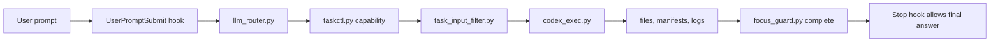

# cc-router-codex

[](https://github.com/yxhpy/cc-router-codex/actions/workflows/ci.yml)
[](https://github.com/yxhpy/cc-router-codex/releases)


Claude/Codex control plane for projects that need Claude Code to stay focused,
route work through explicit roles, and delegate production execution to Codex
with auditable artifacts.

Current release: `v0.1.29`.

## What It Does

`cc-router-codex` installs a portable `.claude` control plane into a target
project. Claude remains the controller; Codex becomes the bounded execution
worker. The hooks enforce role routing, artifact contracts, focus completion,
and fast local checks before production work is allowed to finish.

| Capability | Production behavior |
| --- | --- |
| Task routing | `UserPromptSubmit` classifies the user's goal and emits a `taskctl.py capability` command. |
| Write control | `PreToolUse` blocks direct product writes, allows known lifecycle commands, and asks `gpt-5.4-mini` to review ambiguous Bash commands. |
| Permission mode | Claude Code permission prompts default to `bypassPermissions`; project hooks remain the enforcement layer. |
| Focus guard | `Stop` blocks final answers until the active goal is marked complete or exhausted with evidence. |
| Command catalog | `taskctl command` and `taskctl doctor` print exact local commands so Claude does not need to guess syntax. |
| Command state contracts | Every command contract declares input state, output state, and next recovery state. |
| Failure resume | `taskctl checkpoint-*` saves, restores, lists, and reports resumable job state after failed or blocked work. |
| Artifact quality | `taskctl audit --quality` checks supported Markdown reports for role-specific evidence structure. |
| Project context | Workers read optional `CONTEXT.md` and `docs/adr/` when present; installers do not create them. |
| Skill governance | `.claude/skill-manifest.json` and `tools/skill_manifest_check.py` prevent Claude/plugin skill drift. |
| Experience atoms | `experience-add/list/sync` records atom metadata, filters low-confidence lessons, and marks stale conflicts. |
| Asset generation | `assetgen` uses Codex with `gpt-5.4-mini`, searches prompt templates through `image-2-prompt`, and writes manifests. |
| Install portability | Installers rewrite hook commands to the detected Python executable and installed script paths. |
| Version discipline | Repository releases use SemVer; the prompt-template MCP is tracked by exact git commit SHA. |

## Quick Install

Windows PowerShell, from the target project directory:

```powershell
$p="$env:TEMP\cc-router-install.ps1"; iwr https://raw.githubusercontent.com/yxhpy/cc-router-codex/main/install.ps1 -OutFile $p; powershell -ExecutionPolicy Bypass -File $p
```

Linux/macOS, from the target project directory:

```sh
curl -fsSL https://raw.githubusercontent.com/yxhpy/cc-router-codex/main/install.sh | sh
```

Both commands download this repository to a temporary directory, install into
the current project, generate `.claude/.env` for the local machine, then delete
the temporary copy.

For a user-level global install, install once into the user home directory:

```powershell
python C:\path\to\cc-router-codex\install.py --target C:\Users\Administrator -y
```

Global installs keep stable hooks, scripts, policies, and skills in the user
control plane. When a conversation targets another project, the hooks
automatically create a lightweight project runtime if it is missing:
`.claude/.env`, `.claude/task-plans/`, `.claude/artifacts/`, and
`.claude/cc-router-project.json`. The project-local task database is created at
`.claude/taskctl.sqlite3` when `taskctl.py` first opens it. The project does not
receive copied control-plane scripts unless you explicitly install into that
project.

For non-interactive overwrite:

```powershell
$p="$env:TEMP\cc-router-install.ps1"; iwr https://raw.githubusercontent.com/yxhpy/cc-router-codex/main/install.ps1 -OutFile $p; powershell -ExecutionPolicy Bypass -File $p -Yes
```

```sh
curl -fsSL https://raw.githubusercontent.com/yxhpy/cc-router-codex/main/install.sh | sh -s -- -y
```

To install into an explicit target:

```powershell
$p="$env:TEMP\cc-router-install.ps1"; iwr https://raw.githubusercontent.com/yxhpy/cc-router-codex/main/install.ps1 -OutFile $p; powershell -ExecutionPolicy Bypass -File $p -Target C:\path\to\project
```

```sh
curl -fsSL https://raw.githubusercontent.com/yxhpy/cc-router-codex/main/install.sh | sh -s -- --target /path/to/project
```

## Local Clone Install

From the target project directory:

```powershell
python C:\path\to\cc-router-codex\install.py
```

Or install into an explicit target:

```powershell
python C:\path\to\cc-router-codex\install.py --target C:\path\to\project
```

The installer copies `.claude` and `CLAUDE.md`, generates `.claude/.env`,
excludes runtime state, and rewrites hook commands to stable installed script
paths. If the target already contains `.claude`, `CLAUDE.md`, `VERSION`, or
`VERSIONING.md`, the installer prints the affected paths and continues only
after explicit confirmation.

## Repository Layout

```text
.
|-- .claude/                 Claude hooks, policies, skills, plugins, and scripts
|   |-- scripts/             taskctl, router, guards, installers, tests
|   |-- plugins/             bundled Claude plugin surface
|   `-- skills/              bundled Claude skill instructions
|-- docs/                    architecture and operations guides
|-- tools/                   repository maintenance and governance checks
|-- install.py               local installer
|-- install.ps1              Windows remote bootstrapper
|-- install.sh               POSIX remote bootstrapper
|-- VERSION                  SemVer release version
`-- VERSIONING.md            release and MCP version rules
```

## Control Flow



See [docs/ARCHITECTURE.md](docs/ARCHITECTURE.md) for the component contract and
[docs/OPERATIONS.md](docs/OPERATIONS.md) for install, upgrade, and verification
runbooks.

## Command Contracts

Use the catalog instead of guessing control-plane syntax:

```sh
python .claude/scripts/taskctl.py command capability --workspace /path/to/project
python .claude/scripts/taskctl.py command checkpoint-restore --workspace /path/to/project
python .claude/scripts/taskctl.py doctor --workspace /path/to/project
```

When `PreToolUse` blocks direct workspace reads, data processing, or writes, the hook response includes
`next_command` / `command_contract` fields with a directly executable catalog
lookup command, plus `replacement_command` with the taskctl capability template.
Each returned contract also includes `state_input`, `state_output`, and
`next_state` so the next command can be chosen from recorded state instead of
source inspection or retries.

## Failure Resume

When a job fails, blocks, or reaches Stop without enough evidence, save the
current state before retrying:

```sh
python .claude/scripts/taskctl.py checkpoint-save --job-id 1 --title "Resume blocked implementation"
python .claude/scripts/taskctl.py checkpoint-restore 1 --json
python .claude/scripts/taskctl.py checkpoint-report --job-id 1 --json
python .claude/scripts/taskctl.py audit 1 --quality --json
```

Checkpoints live under `.claude/task-plans/checkpoints/` and summarize the user
goal, job status, completed and missing artifacts, known blocker, next role,
and next command.

`audit --quality` adds non-invasive Markdown structure checks for report-style
artifacts produced by `debugger`, `planner`, `uiux`, `reviewer`, and `closer`.
Default `audit` remains a presence check for compatibility.

## Project Context

Projects may opt in to `CONTEXT.md` for domain vocabulary and `docs/adr/` for
architecture decisions. Worker prompts treat both as soft inputs: use them when
present, continue when absent, and do not create them unless the user
explicitly asks for project-context or ADR documentation.

## Skill Governance

Bundled skills are governed by `.claude/skill-manifest.json`. Run
`python tools/skill_manifest_check.py` to verify that every published skill is
listed, draft/deprecated/private skills are not published, bridge paths are
deterministic, and plugin mirrors match their source directories.

## Experience Atoms

Workers can attach optional atom metadata to reusable lessons:
`--atom-type`, `--topic`, `--skill`, `--source-url-or-path`,
`--source-command`, and `--failure-signature`. Accepted lessons still sync to
the compact `learned-experience` skill; use
`experience-sync-skill --min-confidence 4` to hide low-confidence accepted
items from the generated index. Use `experience-stale` to mark lessons stale and
record conflicting evidence.

## Asset Generation

Asset generation uses `.claude/scripts/assetgen_exec.py`. Before Codex creates
raster files, `.claude/scripts/prompt_template_mcp.py` performs a fast local
check for the `image-2-prompt` MCP under `.prompt-searcher`. If missing, it
installs from `https://github.com/yxhpy/image-2-prompt`, smoke-tests the MCP,
writes a ready marker, searches suitable prompt templates, and injects that
template context into the `gpt-5.4-mini` asset prompt.

Later checks use cached readiness and file fingerprints so normal generation
stays fast. MCP upgrades are explicit and never happen silently during image
generation.

Manual MCP checks:

```powershell
python .claude\scripts\prompt_template_mcp.py check --workspace . --json
python .claude\scripts\prompt_template_mcp.py ensure --workspace . --json
python .claude\scripts\prompt_template_mcp.py version --workspace . --refresh --json
```

## Focus Guard

Production prompts are protected by a hard focus guard. `UserPromptSubmit`
writes `.claude/task-plans/focus_state.json`; the `Stop` hook blocks final
answers until the controller records either completion:

```powershell
python .claude\scripts\focus_guard.py complete --workspace . --evidence "<artifacts/tests/result>"
```

or exhaustion after all viable approaches have been tried:

```powershell
python .claude\scripts\focus_guard.py exhausted --workspace . --evidence "<attempts and blockers>"
```

## Verification

Run the full local gate:

```powershell
python -B .claude\scripts\test_all.py
```

Optional host-real gates:

```powershell
python -B .claude\scripts\test_all.py --real-codex
python -B .claude\scripts\test_all.py --real-claude-cli
```

The standard suite covers hooks, routing, task input filtering, model policy,
Codex wrapper behavior, asset generation, prompt-template MCP integration,
installer rewriting, policy checks, and Python compilation.

## Project Docs

- [Architecture](docs/ARCHITECTURE.md)
- [Operations](docs/OPERATIONS.md)
- [Project Context](docs/PROJECT_CONTEXT.md)
- [Skill Source Of Truth](docs/SKILL_SOURCE_OF_TRUTH.md)
- [Versioning](VERSIONING.md)
- [Changelog](CHANGELOG.md)
- [Contributing](CONTRIBUTING.md)
