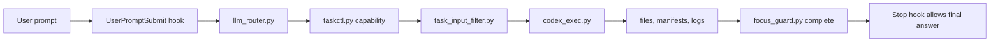

# cc-router-codex

[](https://github.com/yxhpy/cc-router-codex/actions/workflows/ci.yml)
[](https://github.com/yxhpy/cc-router-codex/releases)


Claude/Codex control plane for projects that need Claude Code to stay focused,
route work through explicit roles, and delegate production execution to Codex
with auditable artifacts.

Current release: `v0.1.7`.

## What It Does

`cc-router-codex` installs a portable `.claude` control plane into a target
project. Claude remains the controller; Codex becomes the bounded execution
worker. The hooks enforce role routing, artifact contracts, focus completion,
and fast local checks before production work is allowed to finish.

| Capability | Production behavior |
| --- | --- |
| Task routing | `UserPromptSubmit` classifies the user's goal and emits a `taskctl.py capability` command. |
| Write control | `PreToolUse` blocks direct product writes unless work is routed through the control plane. |
| Focus guard | `Stop` blocks final answers until the active goal is marked complete or exhausted with evidence. |
| Asset generation | `assetgen` uses Codex with `gpt-5.4-mini`, searches prompt templates through `image-2-prompt`, and writes manifests. |
| Install portability | Installers rewrite hook commands to the detected Python executable and installed script paths. |
| Version discipline | Repository releases use SemVer; the prompt-template MCP is tracked by exact git commit SHA. |

## Quick Install

Windows PowerShell, from the target project directory:

```powershell
$p="$env:TEMP\cc-router-install.ps1"; iwr https://raw.githubusercontent.com/yxhpy/cc-router-codex/main/install.ps1 -OutFile $p; powershell -ExecutionPolicy Bypass -File $p
```

Linux/macOS, from the target project directory:

```sh
curl -fsSL https://raw.githubusercontent.com/yxhpy/cc-router-codex/main/install.sh | sh
```

Both commands download this repository to a temporary directory, install into
the current project, generate `.claude/.env` for the local machine, then delete
the temporary copy.

For non-interactive overwrite:

```powershell
$p="$env:TEMP\cc-router-install.ps1"; iwr https://raw.githubusercontent.com/yxhpy/cc-router-codex/main/install.ps1 -OutFile $p; powershell -ExecutionPolicy Bypass -File $p -Yes
```

```sh
curl -fsSL https://raw.githubusercontent.com/yxhpy/cc-router-codex/main/install.sh | sh -s -- -y
```

To install into an explicit target:

```powershell
$p="$env:TEMP\cc-router-install.ps1"; iwr https://raw.githubusercontent.com/yxhpy/cc-router-codex/main/install.ps1 -OutFile $p; powershell -ExecutionPolicy Bypass -File $p -Target C:\path\to\project
```

```sh
curl -fsSL https://raw.githubusercontent.com/yxhpy/cc-router-codex/main/install.sh | sh -s -- --target /path/to/project
```

## Local Clone Install

From the target project directory:

```powershell
python C:\path\to\cc-router-codex\install.py
```

Or install into an explicit target:

```powershell
python C:\path\to\cc-router-codex\install.py --target C:\path\to\project
```

The installer copies `.claude` and `CLAUDE.md`, generates `.claude/.env`,
excludes runtime state, and rewrites hook commands to stable installed script
paths. If the target already contains `.claude`, `CLAUDE.md`, `VERSION`, or
`VERSIONING.md`, the installer prints the affected paths and continues only
after explicit confirmation.

## Repository Layout

```text
.
|-- .claude/                 Claude hooks, policies, skills, plugins, and scripts
|   |-- scripts/             taskctl, router, guards, installers, tests
|   |-- plugins/             bundled Claude plugin surface
|   `-- skills/              bundled Claude skill instructions
|-- docs/                    architecture and operations guides
|-- install.py               local installer
|-- install.ps1              Windows remote bootstrapper
|-- install.sh               POSIX remote bootstrapper
|-- VERSION                  SemVer release version
`-- VERSIONING.md            release and MCP version rules
```

## Control Flow



See [docs/ARCHITECTURE.md](docs/ARCHITECTURE.md) for the component contract and
[docs/OPERATIONS.md](docs/OPERATIONS.md) for install, upgrade, and verification
runbooks.

## Asset Generation

Asset generation uses `.claude/scripts/assetgen_exec.py`. Before Codex creates
raster files, `.claude/scripts/prompt_template_mcp.py` performs a fast local
check for the `image-2-prompt` MCP under `.prompt-searcher`. If missing, it
installs from `https://github.com/yxhpy/image-2-prompt`, smoke-tests the MCP,
writes a ready marker, searches suitable prompt templates, and injects that
template context into the `gpt-5.4-mini` asset prompt.

Later checks use cached readiness and file fingerprints so normal generation
stays fast. MCP upgrades are explicit and never happen silently during image
generation.

Manual MCP checks:

```powershell
python .claude\scripts\prompt_template_mcp.py check --workspace . --json
python .claude\scripts\prompt_template_mcp.py ensure --workspace . --json
python .claude\scripts\prompt_template_mcp.py version --workspace . --refresh --json
```

## Focus Guard

Production prompts are protected by a hard focus guard. `UserPromptSubmit`
writes `.claude/task-plans/focus_state.json`; the `Stop` hook blocks final
answers until the controller records either completion:

```powershell
python .claude\scripts\focus_guard.py complete --workspace . --evidence "<artifacts/tests/result>"
```

or exhaustion after all viable approaches have been tried:

```powershell
python .claude\scripts\focus_guard.py exhausted --workspace . --evidence "<attempts and blockers>"
```

## Verification

Run the full local gate:

```powershell
python -B .claude\scripts\test_all.py
```

Optional host-real gates:

```powershell
python -B .claude\scripts\test_all.py --real-codex
python -B .claude\scripts\test_all.py --real-claude-cli
```

The standard suite covers hooks, routing, task input filtering, model policy,
Codex wrapper behavior, asset generation, prompt-template MCP integration,
installer rewriting, policy checks, and Python compilation.

## Project Docs

- [Architecture](docs/ARCHITECTURE.md)
- [Operations](docs/OPERATIONS.md)
- [Versioning](VERSIONING.md)
- [Changelog](CHANGELOG.md)
- [Contributing](CONTRIBUTING.md)
