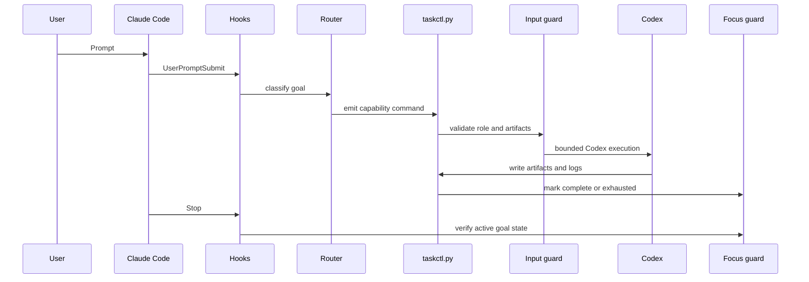

# Architecture

`cc-router-codex` is a Claude Code control plane. Its main rule is simple:
Claude can reason and orchestrate, but production execution must pass through
the local control-plane scripts before files are created or changed.

## Runtime Contract

## Components

| Component | Responsibility |
| --- | --- |
| `.claude/settings.json` | Registers Claude hooks and allowed control-plane commands. |
| `.claude/scripts/hook_user_prompt_submit.py` | Converts the raw user goal into focused routing context. |
| `.claude/scripts/llm_router.py` | Chooses the role and target artifact contract. |
| `.claude/scripts/taskctl.py` | Main command surface for controlled execution. |
| `.claude/scripts/command_catalog.py` | Machine-readable command contracts for exact local command discovery. |
| `.claude/scripts/task_input_filter.py` | Validates role, prompt, artifact paths, and role/artifact compatibility. |
| `.claude/scripts/codex_exec.py` | Runs Codex and writes durable logs instead of relying on stream output. |
| `.claude/scripts/focus_guard.py` | Stores active goal state and blocks premature final answers. |
| `.claude/scripts/assetgen_exec.py` | Generates raster assets through Codex and records manifests. |
| `.claude/scripts/prompt_template_mcp.py` | Installs, checks, versions, and queries the image prompt-template MCP. |

## State Boundaries

Runtime state is intentionally excluded from releases and installs:

- `.claude/.env`
- `.claude/artifacts/`
- `.claude/task-plans/`
- `.claude/taskctl.sqlite3*`
- `.claude/logs/`
- `.prompt-searcher/`

Installers copy the distributable control plane, generate local machine state,
and rewrite hook commands to absolute installed script paths. This keeps global
and project-level installs independent of the shell's current working
directory.

## Command Contracts

Claude should not infer control-plane command syntax from source files.
`taskctl command <name>` returns one command contract with purpose, write
behavior, examples, and the current machine's executable path. `taskctl doctor`
prints command and environment diagnostics. PreToolUse blocks include
`next_command` and `command_contract` fields with a directly executable catalog
lookup command, plus `replacement_command` with the taskctl capability template.

## Role Boundaries

Roles are enforced by `task_input_filter.py`, not only by prompt wording. For
example, `assetgen` can produce image files, manifests, and asset briefs, but it
cannot silently become a product-code writer. Product work must use the
appropriate role and artifact contract.

Operational and governance roles are intentionally separate from product-code
implementation: `debugger` diagnoses failures, `operator` owns install/build/CI
and runtime operations, `security` audits risk, `docs` writes documentation, and
`release` owns versioning and release verification. `fullstack` remains the only
role allowed to create or modify product implementation code.

## Failure Model

The control plane prefers explicit blocking over silent fallback:

- Direct product writes are blocked by `PreToolUse`.
- Unfocused or unfinished sessions are blocked by `Stop`.
- Unknown or outdated prompt-template MCP versions warn before upgrade.
- Codex output is persisted to disk so logs and deliverables can be audited.
